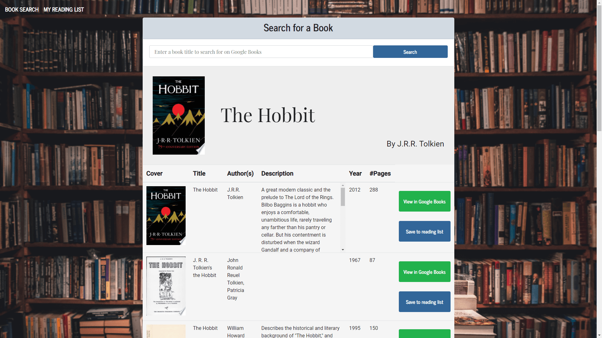
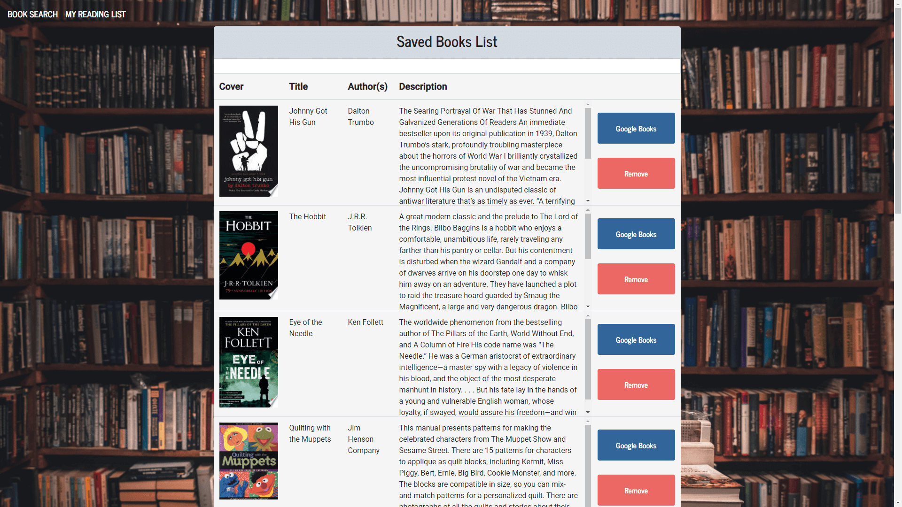

# Google Books Search

A full MERN-stack (Mongo, Express, React, Node) application for searching for books on Google Books and saving them in a database for easy retrieval.

<p>
    
    
    
    
    
    
    
</p>

  
---
  ## Contents

  1. [About](#about)
      1. [User Story](#user%20story)
      2. [Acceptance criteria](#acceptance%20criteria)
      3. [Visuals](#visuals)
      4. [Build](#build)
  2. [Installation](#installation)
  3. [License](#license)
  4. [Contributing](#contributing)
  5. [Contact](#contact-information)

---
  ## About

  Users can search for books via the Google Books API and render them here. User has the option to "View" a book, bringing them to the book on Google Books, or "Save" a book, saving it to the Mongo database. Renders all books saved to the Mongo database to the page. User has an option to "View" the book, bringing them to the book on Google Books, or "Delete" a book, removing it from the Mongo database. 

---

  ### User Story
  
  
```
AS A reader
I WANT to be able to search for books by title
SO THAT I can save them to a database for viewing later
```

---

  ### Acceptance Criteria
  
```md
GIVEN an application that accepts user input
WHEN I enter the title of a book
THEN the site searches the Google Books API for relevant matches
WHEN I am returned a list of results
THEN I am able to save individual results to a database for later retrieval or to view that book on Google Books
WHEN I view the saved books page
THEN I am able to view the book in Google Books
WHEN I select the delete button on a book
THEN the book is removed from the database and the page
```
  
---
## Visuals:



  
---

## Installation:
  

  To clone the repo:
  
      git clone git@github.com:jfisher396/google-books-search.git
  
---

## License
  [](https://opensource.org/licenses/MIT)
  * For more information on license types, please reference this website
  for additional licensing information - [https: //choosealicense.com/](https://choosealicense.com/).

---

## Contributing:
  
  To contribute to this application, create a pull request.
  Here are the steps needed for doing that:
  - Fork the repo
  - Create a feature branch (git checkout -b NAME-HERE)
  - Commit your new feature (git commit -m 'Add some feature')
  - Push your branch (git push)
  - Create a new Pull Request

  Following a code review, your feature will be merged.


---

## Contact Information:
  * GitHub Username: [jfisher396](https://github.com/jfisher396)
  * GitHub Email: james@james-fisher-web-developer.com
  * <p>
    <a href="https://www.linkedin.com/in/jamesfisher-webdev/"></a>
    </p>
  